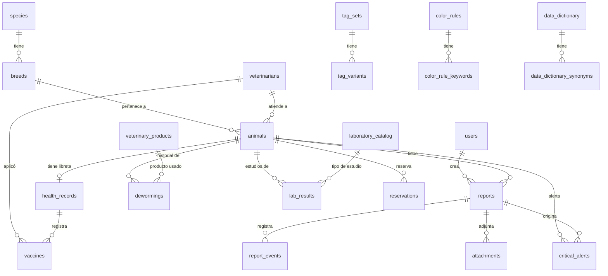

# Esquema de Base de Datos - Guardería Canina

Este documento describe la estructura, el modelo Entidad-Relación (ER) y el análisis de **normalización** de la base de datos del sistema.

> Documentación relacionada: [README.md](./README.md) · [README_NLP.md](./README_NLP.md) · [README_PWA.md](./README_PWA.md) · [README_GRAFICOS.md](./README_GRAFICOS.md)

## Migración de normalización

Tras actualizar modelos, ejecutar:

```powershell
cd backend
python -m src.database.init_db
python -m src.database.migrate_normalize
```

El script `migrate_normalize` migra datos CSV legacy a tablas hijas, unifica desparasitaciones y aplica constraints.

---

## Diagrama Entidad-Relación (ER)



### Tablas de configuración IA (1FN)

| Tabla padre | Tabla hija | Constraint |
|-------------|------------|------------|
| `tag_sets` | `tag_variants(variant)` | UNIQUE(tag_set_id, variant) |
| `color_rules` | `color_rule_keywords(keyword)` | UNIQUE(color_rule_id, keyword) |
| `data_dictionary` | `data_dictionary_synonyms(synonym)` | UNIQUE(dictionary_id, synonym) |

---

## Análisis de Normalización (actualizado)

### Resumen por forma normal

| Forma normal | Estado | Comentario |
|---|---|---|
| **1FN** | ✅ Cumple | Variantes, keywords y sinónimos en tablas hijas. `fields_config` sigue como JSON string (config estática). |
| **2FN** | ✅ Cumple | PK surrogate en todas las tablas. |
| **3FN** | ✅ Mayormente | Vacunas usan `veterinarian_id` FK. Alertas sin texto redundante. |
| **BCNF** | ✅ Aceptable | Núcleo transaccional sin anomalías graves. |

### Correcciones aplicadas

| Issue | Solución |
|-------|----------|
| CSV en `tag_sets`, `color_rules`, `data_dictionary` | Tablas `tag_variants`, `color_rule_keywords`, `data_dictionary_synonyms` |
| `vaccines.veterinarian_name` texto libre | `vaccines.veterinarian_id` → FK `veterinarians` |
| `internal_dewormings` + `external_dewormings` duplicadas | Tabla unificada `dewormings` (tipo en `veterinary_products.type`) |
| `critical_alerts.message` con nombre embebido | Eliminado; mensaje se compone en API desde `keyword_detected` |
| Sin UNIQUE en razas, eventos, catálogos | `UNIQUE(species_id, name)` en breeds, `UNIQUE(report_id, event_type_id)` en report_events, `UNIQUE(name)` en catálogos |

### Decisiones de diseño conservadas (válidas)

| Campo | Razón |
|-------|-------|
| `attachments.animal_id` + `report_id` | Permite fotos sin reporte asociado |
| `animals.severity` | Caché de lectura rápida para el dashboard (`normal` / `observation` / `critical`) |
| `animals.is_daycare` | Distingue mascotas de guardería (casita) vs externas (solo calendario/reservas). Default `true` |
| `animals.coat_color` + edad / rescate / SÍMIL / rasgos | Perfil operativo del paciente (texto y flags; sin catálogo de pelajes) |
| `data_dictionary.fields_config` | JSON de configuración de campos, no dato transaccional |

### TagSets obligatorios

Los conjuntos **Comida, Agua, Pis, Caca** se aseguran en migración/helpers (`REQUIRED_TAG_SETS`) y **no se pueden eliminar** por API. El resto de TagSets es opcional.

---

## Constraints de integridad

| Tabla | Constraint |
|-------|------------|
| `breeds` | UNIQUE(species_id, name) |
| `report_events` | UNIQUE(report_id, event_type_id) |
| `laboratory_catalog` | UNIQUE(name) |
| `vaccine_catalog` | UNIQUE(name) |
| `veterinary_products` | UNIQUE(name, type) |
| `tag_variants` | UNIQUE(tag_set_id, variant) |
| `color_rule_keywords` | UNIQUE(color_rule_id, keyword) |

---

## Detalle de tablas principales

### `users`
- `username`, `hashed_password`, `role` (`admin` | `user`), `is_active`
- Auth JWT (`SECRET_KEY`); CRUD en `/users/`

### `animals`
- Núcleo: `name`, `species_id`, `breed_id`, `veterinarian_id`, `sex`, `is_castrated`, `birth_date`, `photo_url`, `is_active`
- `is_daycare` (default `true`): casita vs solo calendario
- `severity`: `normal` | `observation` | `critical` (caché dashboard)

| Campo | Tipo | Uso |
|-------|------|-----|
| `coat_color` | string | Color del pelaje |
| `is_rescue` | bool | Rescate → edad estimada + suele ir con SÍMIL |
| `age_years` | float | Edad conocida (años) si **no** es rescate |
| `age_estimate_min` / `age_estimate_max` | float | Rango estimado si es rescate |
| `is_simil_breed` | bool | La raza elegida es *SÍMIL a…* (no pura) |
| `is_blind` | bool | Ciego |
| `is_deaf` | bool | Sordo |
| `no_smell` | bool | Sin olfato |
| `has_neurological` | bool | Temas neurológicos |
| `has_involuntary_movements` | bool | Movimientos involuntarios |

Migración: `python -m src.database.migrate_normalize` agrega estas columnas si faltan.

### `reservations`
- `animal_id`, fechas, `status`, notas
- Estados estadía: Pendiente, Confirmada, Ingresada, Finalizada, Cancelada → solo `is_daycare = false`
- Estados servicio: Llevar Veterinaria, Viene Veterinaria, Llevar a Bañar → solo `is_daycare = true`

### `reports` + `report_events` + `attachments`
- Reporte: `animal_id`, `user_id`, `audio_transcript`, `cleaned_text`, timestamps
- Eventos: `event_type_id`, `value`, UNIQUE(report_id, event_type_id)
- Adjuntos: `animal_id`, `report_id` nullable, `file_path` / URL (fotos en `uploads/photos/`)

### `lab_results`
- `animal_id`, `laboratory_id`, `date`, `document_url` (`uploads/labs/`)
- Incluidos en PDF clínico (`/reports/export-pdf/{id}`)

### `dewormings` (unificada)
- `animal_id`, `product_id`, `date`, `next_due_date`
- Tipo interno/externo: `veterinary_products.type` = `INTERNAL` | `EXTERNAL`
- API legacy: `/internal_dewormings` y `/external_dewormings` filtran por tipo

### `vaccines`
- `veterinarian_id` FK nullable (reemplaza `veterinarian_name`)
- `health_record_id`, `vaccine_id`, fechas, lote

### `critical_alerts`
- `animal_id`, `report_id`, `keyword_detected`, `is_resolved`, fechas
- Sin columna `message` (se genera en runtime)

### Helpers
- `backend/src/services/tag_helpers.py` — CRUD variantes/keywords + TagSets obligatorios
- `backend/src/database/migrate_normalize.py` — migración one-shot (incluye `animals.is_daycare`)

### Calendario y `is_daycare`
- **Nueva Reserva** → solo animales con `is_daycare = false` (externas)
- **Vet / Baño** → solo animales con `is_daycare = true` (guardería)
- Validación también en `reservation_routes.py`

---

## Conclusión

El esquema cumple **1FN, 2FN y 3FN** en el núcleo clínico y de configuración IA. Las únicas desviaciones intencionales son cachés de rendimiento (`animals.severity`) y redundancia controlada (`attachments.animal_id`).
