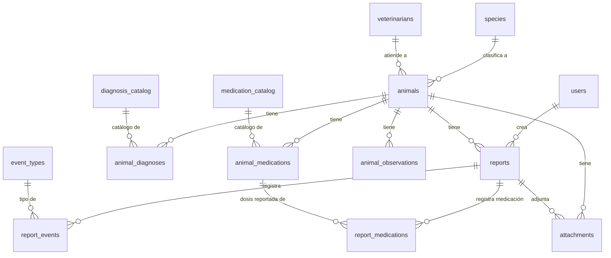

# Esquema de Base de Datos - Guardería Canina

Este documento describe la estructura y el modelo Entidad-Relación (ER) de la base de datos del sistema de la Guardería Canina.

## Diagrama Entidad-Relación (ER)

El siguiente diagrama muestra las relaciones principales entre las entidades del sistema (Usuarios, Animales, Reportes, Catálogos, etc.).

## Detalle de Tablas y Campos

A continuación, se detalla cada tabla con sus respectivos campos y tipos de datos:

### 1. Entidades Principales

#### `users` (Usuarios del sistema)
- `id` (Integer, PK)
- `name` (String, Unique) - Nombre del usuario (ej. 'admin', 'cathy').
- `role` (String) - Rol del usuario ('admin' o 'user'). Determina los accesos al Dashboard.
- `password_hash` (String) - Contraseña encriptada con bcrypt para seguridad.

#### `species` (Especies de animales)
- `id` (Integer, PK)
- `name` (String, Unique) - Nombre de la especie (ej. Perro, Gato).

#### `veterinarians` (Veterinarios asignados)
- `id` (Integer, PK)
- `name` (String) - Nombre del veterinario.
- `phone` (String, Opcional) - Teléfono de contacto.
- `email` (String, Opcional) - Email de contacto.

#### `animals` (Pacientes / Animales)
- `id` (Integer, PK)
- `name` (String) - Nombre del animal.
- `species_id` (Integer, FK -> `species.id`)
- `veterinarian_id` (Integer, FK -> `veterinarians.id`, Opcional)
- `birth_date` (Date, Opcional) - Fecha de nacimiento.
- `sex` (String, Opcional) - Sexo ('M', 'F', 'U').
- `photo_url` (String, Opcional) - URL de la foto de perfil.
- `is_active` (Boolean) - Si el animal está activo en el sistema.

### 2. Reportes Diarios

#### `reports` (Reportes generales de estado)
- `id` (Integer, PK)
- `created_at` (DateTime) - Fecha y hora de creación.
- `user_id` (Integer, FK -> `users.id`) - Usuario que creó el reporte.
- `animal_id` (Integer, FK -> `animals.id`) - Animal al que pertenece el reporte.
- `audio_transcript` (Text, Opcional) - Texto base transcrito por la IA del audio original.
- `weight` (Float, Opcional) - Peso registrado en el momento del reporte.

#### `report_events` (Eventos o síntomas rutinarios en el reporte)
- `id` (Integer, PK)
- `report_id` (Integer, FK -> `reports.id`)
- `event_type_id` (Integer, FK -> `event_types.id`) - Tipo de evento (agua, pis, caca, etc.).
- `value` (String, Opcional) - Valor descriptivo (ej. "blanda", "normal").
- `severity` (Integer, Opcional) - Escala de severidad (1 a 5).

#### `report_medications` (Medicaciones administradas en un reporte)
- `id` (Integer, PK)
- `report_id` (Integer, FK -> `reports.id`)
- `animal_medication_id` (Integer, FK -> `animal_medications.id`) - Referencia a la medicación asignada al animal.
- `time_administered` (DateTime) - Hora exacta de administración.
- `notes` (String, Opcional) - Notas adicionales sobre la toma.

### 3. Catálogos Normalizados

#### `diagnosis_catalog` (Catálogo de Diagnósticos)
- `id` (Integer, PK)
- `name` (String, Unique) - Nombre de la enfermedad/condición.

#### `medication_catalog` (Catálogo de Medicamentos)
- `id` (Integer, PK)
- `name` (String, Unique) - Nombre comercial del medicamento.
- `active_principle` (String, Opcional) - Droga o principio activo.

#### `event_types` (Tipos de Eventos Rutinarios)
- `id` (Integer, PK)
- `name` (String, Unique) - Nombre del evento (ej. comida, pis, vómito).

### 4. Tablas Intermedias / Historiales Clínicos

#### `animal_diagnoses` (Diagnósticos asignados a un animal)
- `id` (Integer, PK)
- `animal_id` (Integer, FK -> `animals.id`)
- `diagnosis_id` (Integer, FK -> `diagnosis_catalog.id`)
- `date_diagnosed` (Date, Opcional) - Fecha en la que se diagnosticó.

#### `animal_medications` (Tratamientos/Medicaciones asignados a un animal)
- `id` (Integer, PK)
- `animal_id` (Integer, FK -> `animals.id`)
- `medication_id` (Integer, FK -> `medication_catalog.id`)
- `dosage` (String) - Dosis recetada.
- `frequency` (String) - Frecuencia de toma (ej. "cada 12h").
- `is_current` (Boolean) - Si el tratamiento sigue activo.

#### `animal_observations` (Observaciones o Alertas permanentes)
- `id` (Integer, PK)
- `animal_id` (Integer, FK -> `animals.id`)
- `observation` (Text) - Descripción de la observación.
- `created_at` (DateTime) - Fecha de creación.

### 5. Configuración del Sistema de IA

#### `data_dictionary` (Diccionario de Datos para la Inteligencia Artificial - Legacy)
- `id` (Integer, PK)
- `table_name` (String, Unique) - Nombre de la tabla destino en BD.
- `entity_name` (String) - Nombre representativo de la categoría.
- `synonyms` (String) - Palabras clave para que la IA detecte de qué se habla.
- `fields_config` (String/JSON) - Esquema JSON con los campos requeridos para extraer.

#### `tag_sets` (Diccionario Auto-Incremental de IA)
- `id` (Integer, PK)
- `name` (String, Unique) - Nombre del conjunto semántico (Comida, Agua, Pis, Caca, Enfermedad).
- `variants` (Text) - Lista separada por comas de sinónimos y modismos. **Este campo se auto-incrementa** a medida que la IA aprende palabras nuevas de los usuarios.

### 6. Multimedia

#### `attachments` (Archivos Adjuntos)
- `id` (Integer, PK)
- `animal_id` (Integer, FK -> `animals.id`)
- `report_id` (Integer, FK -> `reports.id`, Opcional)
- `file_type` (String) - Tipo de archivo (image, video, lab_result).
- `file_url` (String) - Ruta o URL donde se aloja el archivo.
- `uploaded_at` (DateTime) - Fecha de subida.
