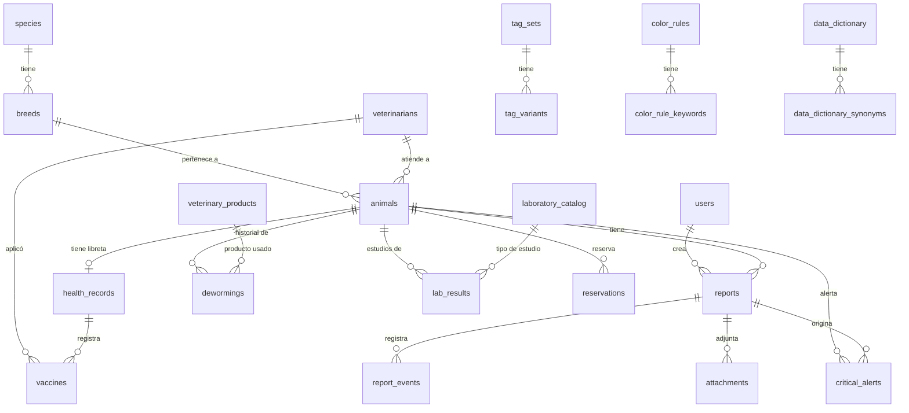

# Esquema de Base de Datos - Guardería Canina

Este documento describe la estructura, el modelo Entidad-Relación (ER) y el análisis de **normalización** de la base de datos del sistema.

> **Índice de documentación:** [docs/README.md](./docs/README.md)  
> Relacionado: [README.md](./README.md) · [README_NLP.md](./README_NLP.md) · [README_PWA.md](./README_PWA.md) · [README_GRAFICOS.md](./README_GRAFICOS.md) · [docs/VACUNAS_ESCANEO.md](./docs/VACUNAS_ESCANEO.md)

## Migración de normalización

Tras actualizar modelos, ejecutar:

```powershell
cd backend
python -m src.database.init_db
python -m src.database.migrate_normalize
```

El script `migrate_normalize` migra datos CSV legacy a tablas hijas, unifica desparasitaciones y aplica constraints.

---

## Diagrama Entidad-Relación (ER)



### Tablas de configuración IA (1FN)

| Tabla padre | Tabla hija | Constraint |
|-------------|------------|------------|
| `tag_sets` | `tag_variants(variant)` | UNIQUE(tag_set_id, variant) |
| `color_rules` | `color_rule_keywords(keyword)` | UNIQUE(color_rule_id, keyword) |
| `data_dictionary` | `data_dictionary_synonyms(synonym)` | UNIQUE(dictionary_id, synonym) |

---

## Análisis de Normalización (actualizado)

### Resumen por forma normal

| Forma normal | Estado | Comentario |
|---|---|---|
| **1FN** | ✅ Cumple | Sin CSV; variantes/keywords/sinónimos en tablas hijas. `fields_config` queda como JSON de config (no hecho transaccional). |
| **2FN** | ✅ Cumple | PK surrogate en todas las tablas; sin attrs parciales sobre claves compuestas. |
| **3FN** | ⚠️ Mayormente | Núcleo clínico OK. Desviaciones **intencionales**: `animals.severity` (caché), `attachments.animal_id` + `report_id` (fotos sin reporte). |
| **BCNF** | ✅ Aceptable | Determinantes son PK/FK; sin anomalías graves en el núcleo. |

### Correcciones aplicadas

| Issue | Solución |
|-------|----------|
| CSV en `tag_sets`, `color_rules`, `data_dictionary` | Tablas `tag_variants`, `color_rule_keywords`, `data_dictionary_synonyms` |
| `vaccines.veterinarian_name` texto libre | `vaccines.veterinarian_id` → FK `veterinarians` |
| `internal_dewormings` + `external_dewormings` duplicadas | Tabla unificada `dewormings` (tipo en `veterinary_products.type`) |
| `critical_alerts.message` con nombre embebido | Eliminado; mensaje se compone en API desde `keyword_detected` |
| Sin UNIQUE en razas, eventos, catálogos | `UNIQUE(species_id, name)` en breeds, `UNIQUE(report_id, event_type_id)` en report_events, `UNIQUE(name)` en catálogos |

### Perfil animal (pelaje / edad / rescate / rasgos) — ¿rompe normalización?

**No.** Los campos nuevos son atómicos (1FN) y dependen solo de la PK de `animals` (2FN/3FN):

| Diseño | Evaluación |
|--------|------------|
| `coat_color` texto libre | OK en 1FN. Un catálogo sería UX/filtros, no obligación de 3FN. |
| Flags `is_blind`, `is_deaf`, etc. | OK para un set cerrado (~5). Tabla `traits` solo si el set crece o se vuelve dinámico. |
| `is_rescue` + `age_years` **o** rango estimado | Atributos distintos; no viola NF. Hace falta **invariante de negocio** (no mezclar ambos modos). |
| `is_simil_breed` + `breed_id` | El flag califica el vínculo animal↔raza; no pertenece a `breeds`. |
| `birth_date` vs `age_years` | Posible redundancia si ambos se usan como hecho; conviene una sola fuente de verdad. |

### Decisiones de diseño conservadas (válidas)

| Campo | Razón |
|-------|-------|
| `attachments.animal_id` + `report_id` | Permite fotos sin reporte asociado (redundancia controlada si hay `report_id`) |
| `animals.severity` | Caché de lectura rápida para el dashboard (`normal` / `observation` / `critical`) |
| `animals.is_daycare` | Distingue mascotas de guardería (casita) vs externas (solo calendario/reservas). Default `true` |
| `animals.coat_color` + edad / rescate / SÍMIL / rasgos | Perfil operativo del paciente (texto y flags; sin catálogo de pelajes) |
| `data_dictionary.fields_config` | JSON de configuración de campos, no dato transaccional |

### Deuda de integridad (no es fallo de forma normal)

Prioridad alta — invariantes a reforzar en API (y opcionalmente CHECK/trigger):

1. Si hay `breed_id`, debe cumplirse `breeds.species_id = animals.species_id`.
2. Al adjuntar con `report_id`, forzar `attachments.animal_id = reports.animal_id`.
3. Edad: si `is_rescue` → usar rango y limpiar `age_years`; si no → limpiar `age_estimate_*`.
4. Considerar `UNIQUE(animal_id, diagnosis_id)` en `animal_diagnoses` (o incluir fecha si se permiten re-diagnósticos).

Opcional: CHECK/enum en `sex`, `severity`, `reservations.status`, `veterinary_products.type`; catálogo de pelaje solo si hace falta filtrar/estadísticas.

### TagSets obligatorios

Los conjuntos **Comida, Agua, Pis, Caca** se aseguran en migración/helpers (`REQUIRED_TAG_SETS`) y **no se pueden eliminar** por API. El resto de TagSets es opcional.

---

## Constraints de integridad

| Tabla | Constraint |
|-------|------------|
| `breeds` | UNIQUE(species_id, name) |
| `report_events` | UNIQUE(report_id, event_type_id) |
| `laboratory_catalog` | UNIQUE(name) |
| `vaccine_catalog` | UNIQUE(name) |
| `veterinary_products` | UNIQUE(name, type) |
| `tag_variants` | UNIQUE(tag_set_id, variant) |
| `color_rule_keywords` | UNIQUE(color_rule_id, keyword) |

---

## Detalle de tablas principales

### `users`
- `name` (login único), `password_hash`, `role` (`admin` | `user`), `is_active`
- Auth JWT (`SECRET_KEY`); CRUD en `/users/`

### `animals`
- Núcleo: `name`, `species_id`, `breed_id`, `veterinarian_id`, `sex`, `is_castrated`, `birth_date`, `photo_url`, `is_active`
- `is_daycare` (default `true`): casita vs solo calendario
- `severity`: `normal` | `observation` | `critical` (caché dashboard)

| Campo | Tipo | Uso |
|-------|------|-----|
| `coat_color` | string | Color del pelaje |
| `is_rescue` | bool | Rescate → edad estimada + suele ir con SÍMIL |
| `age_years` | float | Edad conocida (años) si **no** es rescate |
| `age_estimate_min` / `age_estimate_max` | float | Rango estimado si es rescate |
| `is_simil_breed` | bool | La raza elegida es *SÍMIL a…* (no pura) |
| `is_blind` | bool | Ciego |
| `is_deaf` | bool | Sordo |
| `no_smell` | bool | Sin olfato |
| `has_neurological` | bool | Temas neurológicos |
| `has_involuntary_movements` | bool | Movimientos involuntarios |

Migración: `python -m src.database.migrate_normalize` agrega estas columnas si faltan.

### `reservations`
- `animal_id`, fechas, `status`, notas
- Estados estadía: Pendiente, Confirmada, Ingresada, Finalizada, Cancelada → solo `is_daycare = false`
- Estados servicio: Llevar Veterinaria, Viene Veterinaria, Llevar a Bañar → solo `is_daycare = true`

### `reports` + `report_events` + `attachments`
- Reporte: `animal_id`, `user_id`, `audio_transcript`, `cleaned_text`, timestamps
- Eventos: `event_type_id`, `value`, UNIQUE(report_id, event_type_id)
- Adjuntos: `animal_id`, `report_id` nullable, `file_path` / URL (fotos en `uploads/photos/`)

### `lab_results`
- `animal_id`, `laboratory_id`, `date`, `document_url` (`uploads/labs/`)
- Incluidos en PDF clínico (`/reports/export-pdf/{id}`)

### `dewormings` (unificada)
- `animal_id`, `product_id`, `date`, `next_due_date`
- Tipo interno/externo: `veterinary_products.type` = `INTERNAL` | `EXTERNAL`
- API legacy: `/internal_dewormings` y `/external_dewormings` filtran por tipo

### `vaccines`
- `veterinarian_id` FK nullable (reemplaza `veterinarian_name`)
- `health_record_id`, `vaccine_id`, fechas, lote
- `document_url` — URL pública en Supabase Storage (certificado/libreta escaneada; carpeta `vaccines/`)

### `critical_alerts`
- `animal_id`, `report_id`, `keyword_detected`, `is_resolved`, fechas
- Sin columna `message` (se genera en runtime)

### Helpers
- `backend/src/services/tag_helpers.py` — CRUD variantes/keywords + TagSets obligatorios
- `backend/src/database/migrate_normalize.py` — migración one-shot (incluye `animals.is_daycare`)

### Calendario y `is_daycare`
- **Nueva Reserva** → solo animales con `is_daycare = false` (externas)
- **Vet / Baño** → solo animales con `is_daycare = true` (guardería)
- Validación también en `reservation_routes.py`

---

## Conclusión

El esquema cumple **1FN y 2FN** de forma sólida. En **3FN** el núcleo clínico está bien; las únicas desviaciones son **desnormalizaciones conscientes** (`animals.severity`, dual FK en `attachments`). El perfil nuevo (pelaje, edad/rescate, SÍMIL, rasgos) **no rompe** las formas normales: la deuda pendiente es de **invariantes de negocio** (coherencia raza↔especie, modos de edad, adjuntos), no de refactor a catálogos/traits.
