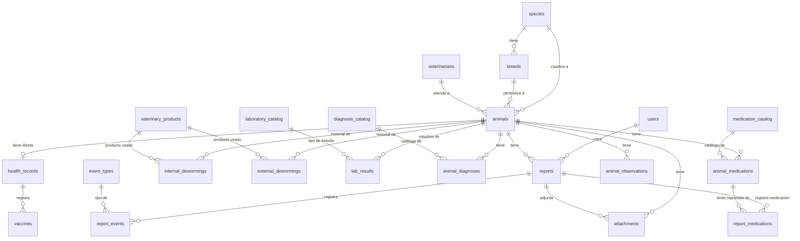

# Esquema de Base de Datos - Guardería Canina

Este documento describe la estructura y el modelo Entidad-Relación (ER) de la base de datos del sistema de la Guardería Canina, incluyendo las actualizaciones de perfiles clínicos avanzados.

## Diagrama Entidad-Relación (ER)

El siguiente diagrama muestra las relaciones principales entre las entidades del sistema (Usuarios, Animales, Reportes, Catálogos, Historial Clínico, etc.).

## Detalle de Tablas y Campos

A continuación, se detalla cada tabla con sus respectivos campos y tipos de datos:

### 1. Entidades Principales

#### `users` (Usuarios del sistema)
- `id` (Integer, PK)
- `name` (String, Unique) - Nombre del usuario (ej. 'admin', 'cathy').
- `role` (String) - Rol del usuario ('admin' o 'user'). Determina los accesos al Dashboard.
- `password_hash` (String) - Contraseña encriptada con bcrypt para seguridad.

#### `species` (Especies de animales)
- `id` (Integer, PK)
- `name` (String, Unique) - Nombre de la especie (ej. Perro, Gato).

#### `breeds` (Razas de animales)
- `id` (Integer, PK)
- `name` (String) - Nombre de la raza (ej. Caniche, Siamés).
- `species_id` (Integer, FK -> `species.id`) - Especie a la que pertenece la raza.

#### `veterinarians` (Veterinarios asignados)
- `id` (Integer, PK)
- `name` (String) - Nombre del veterinario.
- `phone` (String, Opcional) - Teléfono de contacto.
- `email` (String, Opcional) - Email de contacto.

#### `animals` (Pacientes / Animales)
- `id` (Integer, PK)
- `name` (String) - Nombre del animal.
- `species_id` (Integer, FK -> `species.id`)
- `breed_id` (Integer, FK -> `breeds.id`, Opcional) - Raza del animal.
- `veterinarian_id` (Integer, FK -> `veterinarians.id`, Opcional)
- `birth_date` (Date, Opcional) - Fecha de nacimiento.
- `sex` (String, Opcional) - Sexo ('M', 'F', 'U').
- `is_castrated` (Boolean) - Si el animal está castrado.
- `photo_url` (String, Opcional) - URL de la foto de perfil.
- `is_active` (Boolean) - Si el animal está activo en el sistema.

### 2. Historial Clínico Avanzado (Entidades Débiles)

#### `health_records` (Libreta Sanitaria)
- `id` (Integer, PK)
- `animal_id` (Integer, FK -> `animals.id`, Unique) - Relación 1 a 1 con el paciente.
- `creation_date` (Date) - Fecha en que se creó la libreta.
- `notes` (String, Opcional) - Notas generales de la libreta.

#### `vaccines` (Historial de Vacunas)
- `id` (Integer, PK)
- `health_record_id` (Integer, FK -> `health_records.id`)
- `name` (String) - Nombre de la vacuna (ej. Séxtuple, Antirrábica).
- `date_administered` (Date) - Fecha de aplicación.
- `next_due_date` (Date, Opcional) - Fecha del próximo refuerzo.
- `lot_number` (String, Opcional) - Número de lote de la vacuna.
- `veterinarian_name` (String, Opcional) - Veterinario que firmó o aplicó.

#### `internal_dewormings` (Desparasitaciones Internas)
- `id` (Integer, PK)
- `animal_id` (Integer, FK -> `animals.id`)
- `product_id` (Integer, FK -> `veterinary_products.id`) - Referencia al catálogo de productos.
- `date` (Date) - Fecha de aplicación.
- `next_due_date` (Date, Opcional) - Fecha de la próxima dosis.

#### `external_dewormings` (Desparasitaciones Externas)
- `id` (Integer, PK)
- `animal_id` (Integer, FK -> `animals.id`)
- `product_id` (Integer, FK -> `veterinary_products.id`) - Referencia al catálogo de productos.
- `date` (Date) - Fecha de aplicación.
- `next_due_date` (Date, Opcional) - Fecha de la próxima dosis.

#### `lab_results` (Estudios de Laboratorio)
- `id` (Integer, PK)
- `animal_id` (Integer, FK -> `animals.id`)
- `laboratory_id` (Integer, FK -> `laboratory_catalog.id`) - Referencia al catálogo de tipos de estudios.
- `date` (Date) - Fecha del estudio.
- `document_url` (String) - URL física del PDF o imagen alojada en `/uploads/labs`.

### 3. Reportes Diarios

#### `reports` (Reportes generales de estado)
- `id` (Integer, PK)
- `created_at` (DateTime) - Fecha y hora de creación.
- `user_id` (Integer, FK -> `users.id`) - Usuario que creó el reporte.
- `animal_id` (Integer, FK -> `animals.id`) - Animal al que pertenece el reporte.
- `audio_transcript` (Text, Opcional) - Texto transcrito.
- `weight` (Float, Opcional) - Peso.

#### `report_events` y `report_medications`
Tablas de eventos y medicaciones administradas en un reporte específico.

### 4. Catálogos Normalizados

#### `veterinary_products` (Catálogo de Productos de Desparasitación)
- `id` (Integer, PK)
- `name` (String) - Nombre comercial (ej. Drontal, Bravecto).
- `type` (String) - 'INTERNAL' o 'EXTERNAL'.

#### `laboratory_catalog` (Catálogo de Tipos de Estudios)
- `id` (Integer, PK)
- `name` (String) - Nombre del estudio (ej. Hemograma Completo, Ecografía).

#### `diagnosis_catalog` (Diagnósticos), `medication_catalog` (Medicamentos), `event_types` (Tipos de Eventos)
Catálogos fijos para mantener la normalización de la BDD.

### 5. Configuración del Sistema de IA
Las tablas `data_dictionary` y `tag_sets` (Diccionario Auto-Incremental) manejan el motor semántico NLP del sistema.
